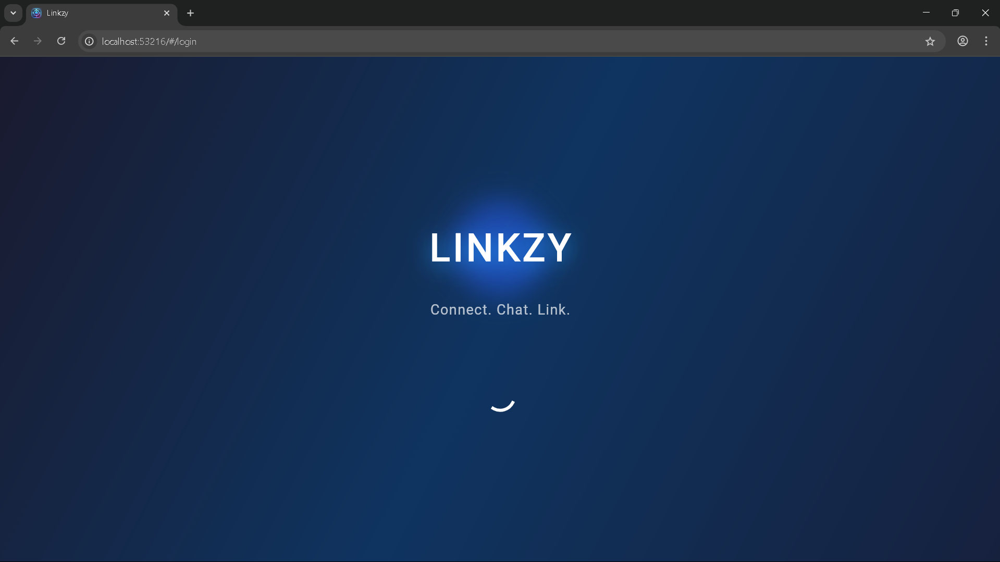
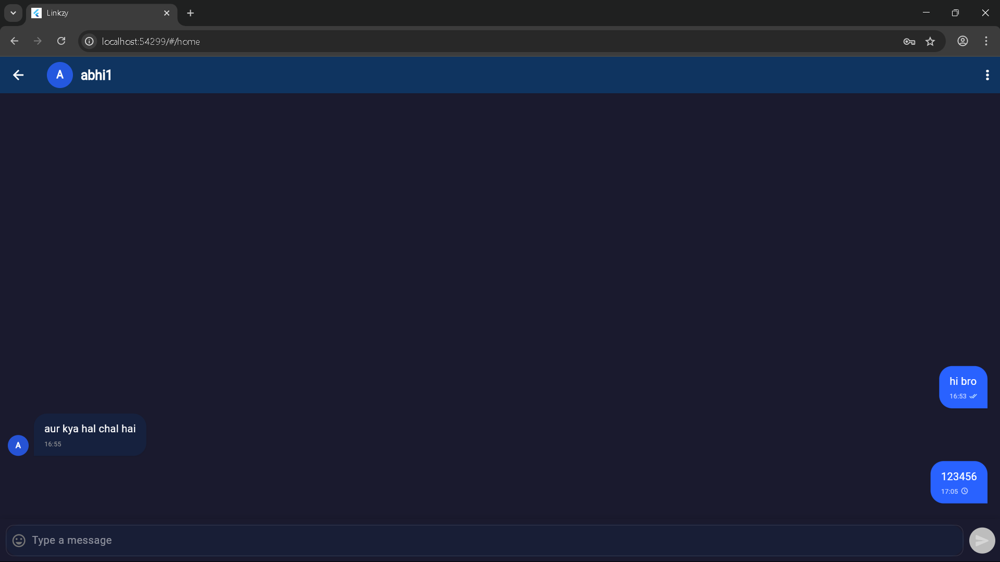
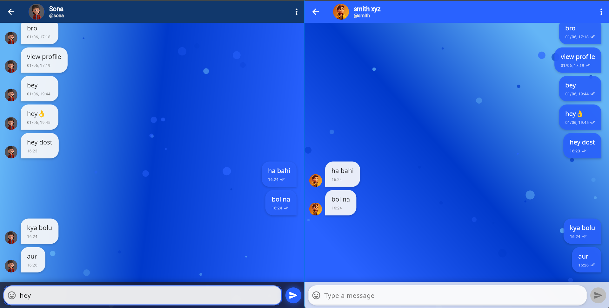
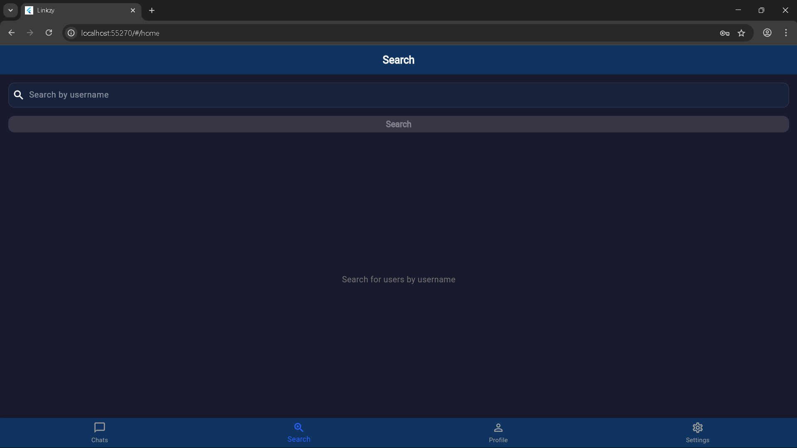
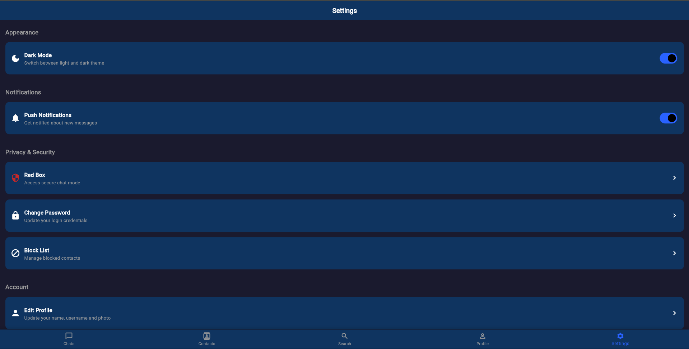

# Linkzy - Real-time Chat Application

A modern real-time 1-on-1 chat application built with Flutter and Firebase, featuring a beautiful UI with interactive animations.

## Features

- **Real-time messaging** with instant delivery and read receipts
- **User authentication** with email and password
- **User profiles** with customizable usernames and profile pictures
- **Responsive design** that works on mobile, web, and desktop platforms
- **Modern UI** with dark mode support and smooth animations
- **Firebase backend** for reliable data storage and synchronization

## Getting Started

For detailed information on setting up and using Linkzy, please refer to our [documentation](docs/index.md).

## Documentation

Our comprehensive documentation includes:

- [Installation Guide](docs/INSTALLATION.md)
- [User Guide](docs/USER_GUIDE.md)
- [Features Overview](docs/FEATURES.md)
- [Architecture Documentation](docs/ARCHITECTURE.md)
- [Firebase Setup](docs/FIREBASE_SETUP.md)

## App Screenshots

  

    

      
      
Splash Screen

    

    

      
      
Chat Interface

    

    

      
      
User Conversation

    

    

      
      
Search for Users

    

    

      
      
Settings

    

  

## Technologies Used

- **Flutter**: UI framework for cross-platform development
- **Firebase Authentication**: User authentication
- **Cloud Firestore**: NoSQL database for messages and user data
- **Firebase Storage**: Storage for profile pictures
- **Provider & Riverpod**: State management

## License

This project is licensed under the MIT License - see the [LICENSE](LICENSE) file for details.

## Contact

For support or inquiries, please open an issue in the project repository.
