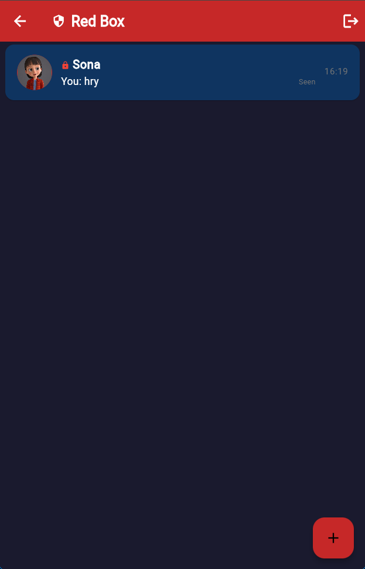

# Linkzy - Real-time Chat Application

<p align="center">
  
</p>

A modern real-time 1-on-1 chat application built with Flutter and Firebase, featuring a beautiful UI with interactive animations.

<div align="center">

<!-- ✨ Paste badges below this line ✨ -->


</div>

## Latest Release Highlights (v1.4.0)

🔥 **New Features:**
- **🛡️ Enhanced Red Box**: Secure chat feature now accessible via Settings
- **🔐 PIN Protection**: Added PIN/passphrase protection for sensitive chats
- **👥 Contact Management**: New dedicated screen for managing contacts
- **🖼️ Animated Chat Backgrounds**: Dynamic chat screen backgrounds
- **👤 Profile Editing**: Fully enabled profile customization

For detailed information about all new features and improvements, check out our [Release Notes](docs/RELEASE_NOTES.md).

## Features

- **Real-time messaging** with instant delivery and read receipts
- **Enhanced chat experience** with auto-focusing message input for rapid conversations
- **User authentication** with email and password
- **User profiles** with customizable usernames and profile pictures
- **Responsive design** that works on mobile, web, and desktop platforms
- **Modern UI** with dark mode support and smooth animations
- **Firebase backend** for reliable data storage and synchronization
- **Red Box feature** for secure, PIN-protected messaging

## Getting Started

For detailed information on setting up and using Linkzy, please refer to our [documentation](docs/index.md).

### Setting Up Firebase Configuration

This project requires Firebase configuration that isn't included in the repository for security reasons:

1. Create a Firebase project at [firebase.google.com](https://firebase.google.com/)
2. Register your app (Android, iOS, Web) in the Firebase console
3. Download the configuration files:
   - `google-services.json` for Android (place in `android/app/`)
   - `GoogleService-Info.plist` for iOS (add to your Xcode project)
4. Copy the example Firebase options file:
   ```bash
   cp lib/firebase_options.example.dart lib/firebase_options.dart
   ```
5. Update `firebase_options.dart` with your Firebase project's values

See [Firebase Setup](docs/FIREBASE_SETUP.md#securing-firebase-configuration) for more detailed instructions.

## Documentation

Our comprehensive documentation includes:

- [Installation Guide](docs/INSTALLATION.md)
- [User Guide](docs/USER_GUIDE.md)
- [Features Overview](docs/FEATURES.md)
- [Architecture Documentation](docs/ARCHITECTURE.md)
- [Firebase Setup](docs/FIREBASE_SETUP.md)
- [Release Notes](docs/RELEASE_NOTES.md)

## App Screenshots

<div align="center">
  <div style="display: grid; grid-template-columns: repeat(auto-fit, minmax(150px, 1fr)); gap: 16px; max-width: 1000px; margin: auto;">
    <div style="text-align: center;">
      
      <p>Splash Screen</p>
    </div>
    <div style="text-align: center;">
      
      <p>Chat Interface</p>
    </div>
    <div style="text-align: center;">
      
      <p>User Conversation</p>
    </div>
    <div style="text-align: center;">
      
      <p>Search for Users</p>
    </div>
    <div style="text-align: center;">
      
      <p>Settings</p>
    </div>
    <div style="text-align: center;">
      
      <p>Red Box</p>
    </div>
  </div>
</div>

## 🛡️ Red Box Screens  

| Chat List | Chat | Cantact |
|------|--------|--------|
|  |  |  |

## Technologies Used

- **Flutter**: UI framework for cross-platform development
- **Firebase Authentication**: User authentication
- **Cloud Firestore**: NoSQL database for messages and user data
- **Firebase Storage**: Storage for profile pictures
- **Provider & Riverpod**: State management

## License

This project is licensed under the MIT License - see the [LICENSE](LICENSE) file for details.

## Contact

For support or inquiries, please open an issue in the project repository.
