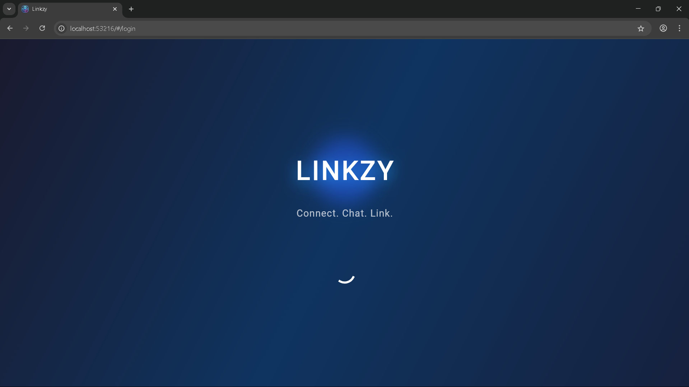
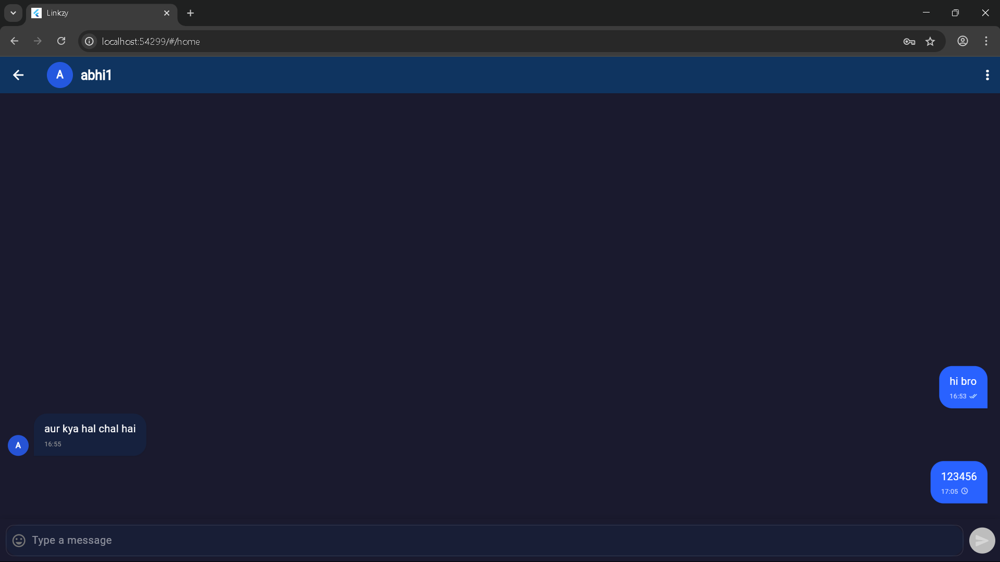
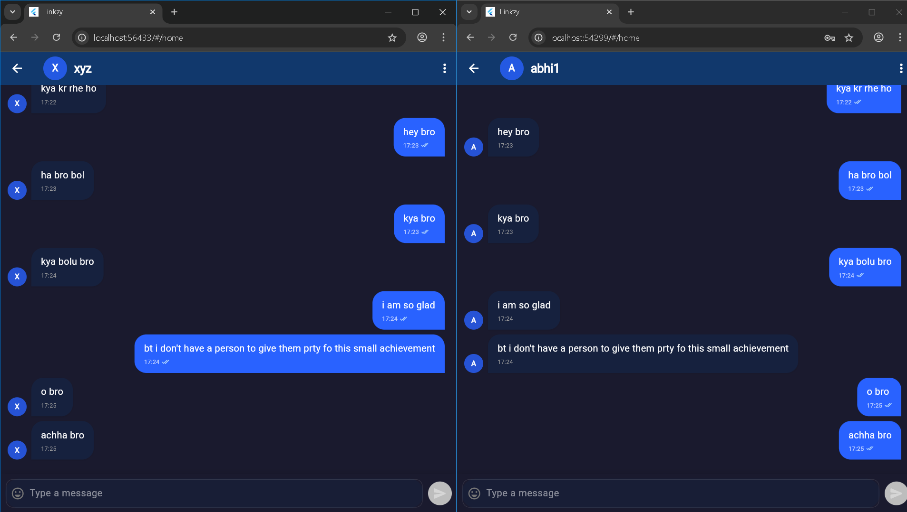
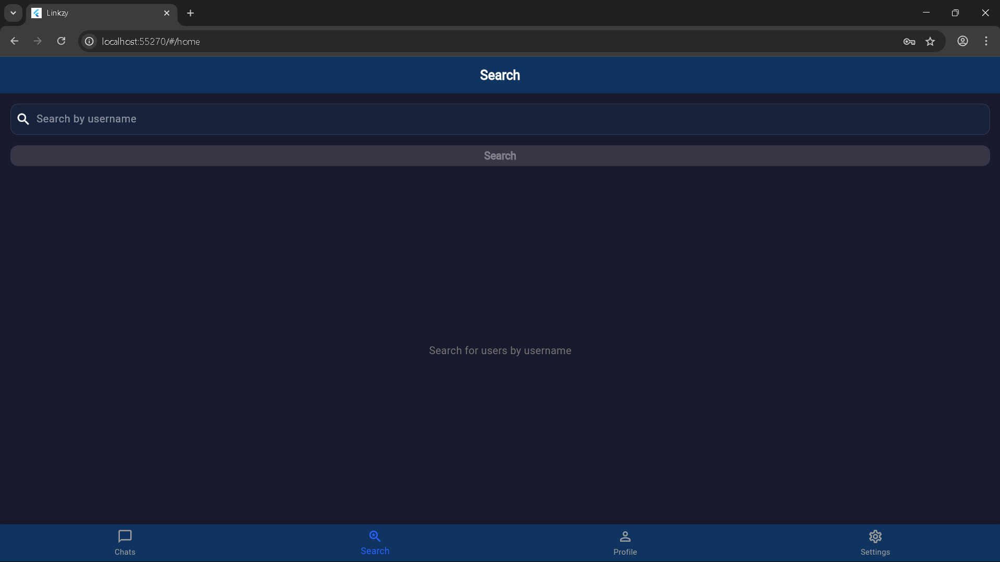

# Linkzy - Real-time Chat Application

## Overview

Linkzy is a modern, real-time 1-on-1 chat application built using Flutter and Firebase. It features a beautiful UI with interactive animations and provides a seamless messaging experience across multiple platforms.

## Features

- **Real-time Messaging**: Instant message delivery with typing indicators
- **User Authentication**: Secure login and registration with Firebase Auth
- **User Profiles**: Customizable user profiles with profile pictures
- **Message Status**: Read receipts and delivery confirmations
- **Responsive Design**: Works on mobile, web, and desktop platforms
- **Dark Mode Support**: UI adapts to system theme preferences
- **Search Functionality**: Find users easily

## Documentation Index

- [Installation Guide](./INSTALLATION.md) - How to set up and run the app
- [Architecture](./ARCHITECTURE.md) - Technical architecture and code structure
- [Features](./FEATURES.md) - Detailed feature specifications
- [Firebase Setup](./FIREBASE_SETUP.md) - Firebase configuration
- [User Guide](./USER_GUIDE.md) - End-user documentation

## Technical Stack

- **Frontend**: Flutter
- **Backend**: Firebase
- **Authentication**: Firebase Authentication
- **Database**: Cloud Firestore
- **Storage**: Firebase Storage
- **Messaging**: Firebase Cloud Messaging

## Screenshots

  <h3>Splash Screen</h3>
  
  
  <h3>Chat Interface</h3>
  
  
  <h3>User Conversation</h3>
  
  
  <h3>User Search</h3>
  
  
  <h3>Settings</h3>
  

## License

This project is licensed under the MIT License - see the [LICENSE](../LICENSE) file for details.

## Contact

For support or inquiries, please open an issue in the project repository. 