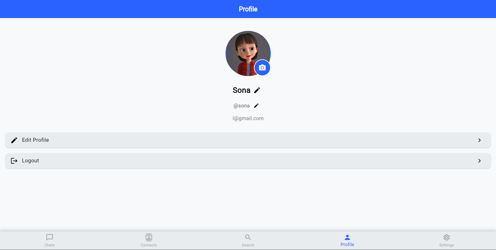

# Linkzy

A real-time 1-on-1 chat application using Flutter with a beautiful UI and interactive animations.

## Features

- Real-time messaging
- User authentication
- Profile customization
- Message notifications
- User blocking capabilities
- Animated chat backgrounds
- Dark and light theme support
- Auto-focusing message input for rapid conversations

## Live Demo

Visit the live demo at [https://abhishek-maurya576.github.io/linkzy/](https://abhishek-maurya576.github.io/linkzy/)

## Screenshots

## Version History

- v1.2.0 - profile editing and Added animated chat backgrounds and dark mode
- Enhanced chat experience with auto-focusing message input and fixed UI refresh issues
- v1.0.0 - Initial release with basic chat functionality

## Documentation Index

- [Installation Guide](./INSTALLATION.md) - How to set up and run the app
- [Architecture](./ARCHITECTURE.md) - Technical architecture and code structure
- [Features](./FEATURES.md) - Detailed feature specifications
- [Firebase Setup](./FIREBASE_SETUP.md) - Firebase configuration
- [User Guide](./USER_GUIDE.md) - End-user documentation

## Technical Stack

- **Frontend**: Flutter
- **Backend**: Firebase
- **Authentication**: Firebase Authentication
- **Database**: Cloud Firestore
- **Storage**: Firebase Storage
- **Messaging**: Firebase Cloud Messaging

## License

This project is licensed under the MIT License - see the [LICENSE](../LICENSE) file for details.

## Contact

For support or inquiries, please open an issue in the project repository. 