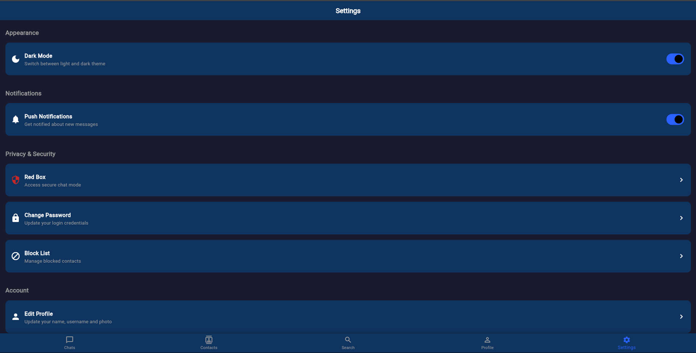
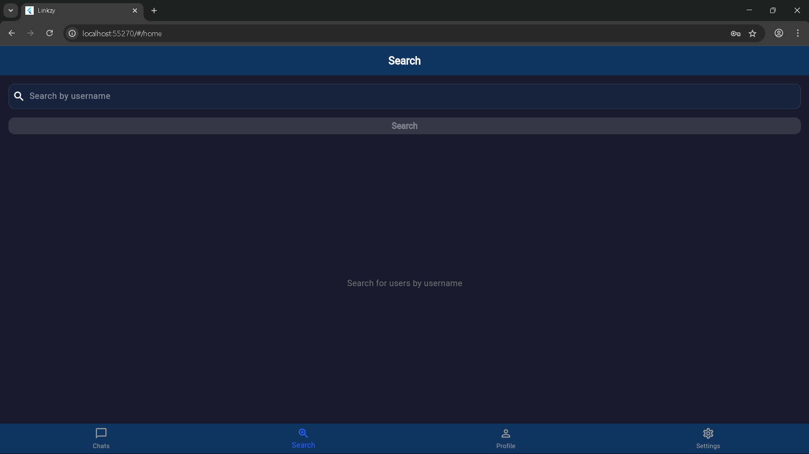
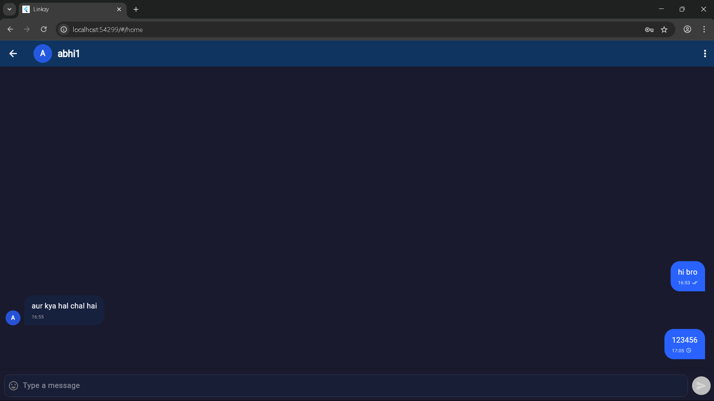

# Linkzy User Guide

Welcome to Linkzy! This guide will help you navigate and make the most of the application's features.

## Table of Contents

1. [Getting Started](#getting-started)
2. [Creating an Account](#creating-an-account)
3. [Navigating the App](#navigating-the-app)
4. [Messaging](#messaging)
5. [Managing Your Profile](#managing-your-profile)
6. [Settings and Preferences](#settings-and-preferences)
7. [Troubleshooting](#troubleshooting)

## Getting Started

### System Requirements

Linkzy works on the following platforms:
- **Mobile**: Android 5.0+ and iOS 11.0+
- **Web**: Modern browsers (Chrome, Firefox, Safari, Edge)
- **Desktop**: Windows, macOS, and Linux (via Flutter desktop)

### Installing the App

#### On Mobile:
- **Android**: Download from Google Play Store (coming soon)
- **iOS**: Download from App Store (coming soon)

#### On Web:
- comming soon

  
  
<em>Linkzy Splash Screen</em>

## Creating an Account

1. Open the Linkzy app
2. Tap "Create Account" on the welcome screen
3. Enter your email address and create a password
4. Tap "Register"
5. Complete your profile by:
   - Adding a username
   - Uploading a profile picture (optional)
   - Tap "Continue"
6. You're now ready to use Linkzy!

### Logging In

1. Open the Linkzy app
2. Enter your email and password
3. Tap "Login"
4. If you've forgotten your password, tap "Forgot Password?" and follow the instructions sent to your email

## Navigating the App

Linkzy has a simple, intuitive interface with four main sections accessible from the bottom navigation bar:

1. **Chats**: View and manage your conversations
2. **Search**: Find other users
3. **Profile**: View and edit your profile
4. **Settings**: Configure application settings

  
  
<em>Settings Screen</em>

## Messaging

### Starting a New Chat

1. Go to the "Search" tab
2. Enter a username in the search bar
3. Select the user from the search results
4. You'll be taken to the chat screen where you can start messaging

  
  
<em>Search for Users</em>

### Sending Messages

1. Tap on a conversation from the "Chats" tab or start a new chat
2. Type your message in the text field at the bottom
3. Tap the send button (arrow icon) to send the message

  
  
<em>Chat Interface</em>

### Understanding Message Status

Each message has indicators to show its status:
- Single check mark (✓): Message was delivered to the server
- Double check mark (✓✓): Message was delivered to the recipient
- Blue double check mark (✓✓): Message was read by the recipient

  
  
<em>Conversation Between Two Users</em>

### Viewing Conversation History

Your complete conversation history is automatically loaded when you open a chat. Scroll up to see older messages.

## Managing Your Profile

### Viewing Your Profile

1. Tap on the "Profile" tab
2. Your profile information will be displayed, including:
   - Username
   - Profile picture
   - Email address

### Editing Your Profile

1. Go to the "Profile" tab
2. Tap "Edit Profile"
3. Make your changes:
   - Tap your profile picture to change it
   - Edit your username
4. Tap "Save" to update your profile

## Settings and Preferences

### Theme Settings

1. Go to the "Settings" tab
2. Tap "Theme"
3. Choose between:
   - Light Mode
   - Dark Mode
   - System Default (follows device settings)

### Notification Preferences

1. Go to the "Settings" tab
2. Tap "Notifications"
3. Toggle notifications on/off for:
   - New messages
   - Message reads
   - New user joins

### Account Management

1. Go to the "Settings" tab
2. Under "Account", you can:
   - Change your password
   - Update your email
   - Delete your account

### Logging Out

1. Go to the "Settings" tab
2. Tap "Log Out"
3. Confirm that you want to log out

## Troubleshooting

### Connection Issues

If you're experiencing connection problems:
1. Check your internet connection
2. Close and reopen the app
3. Ensure you have the latest version installed

### Message Not Sending

If your messages aren't sending:
1. Check your internet connection
2. Verify that the recipient hasn't blocked you
3. Try logging out and back in

### App Crashes

If the app crashes:
1. Update to the latest version
2. Clear the app cache (in device settings)
3. Reinstall the app if problems persist

### Getting Help

If you continue to experience issues:
1. Visit our [Help Center](https://help.linkzy.com) (example URL)
2. Contact support at support@linkzy.com (example email)

---

Thank you for using Linkzy! We hope this guide helps you make the most of our chat application. 